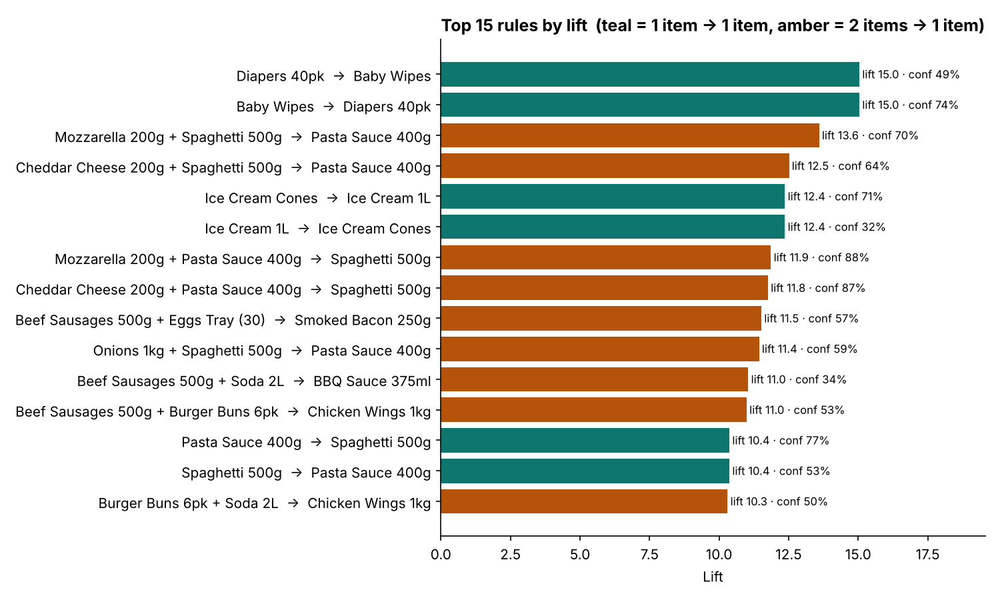
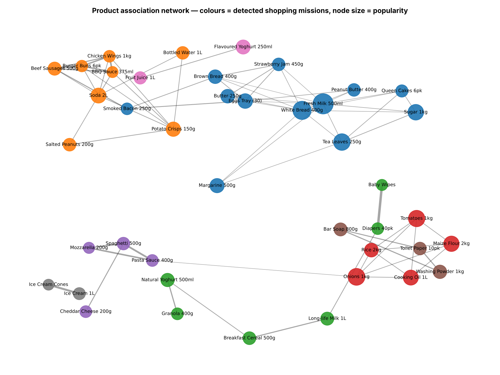
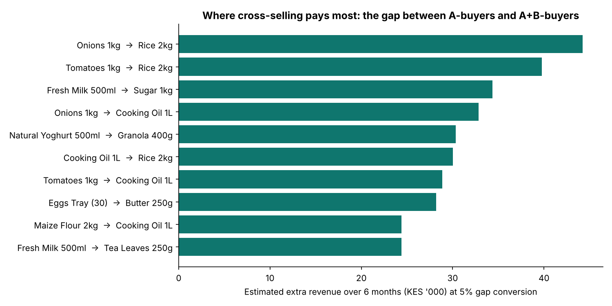
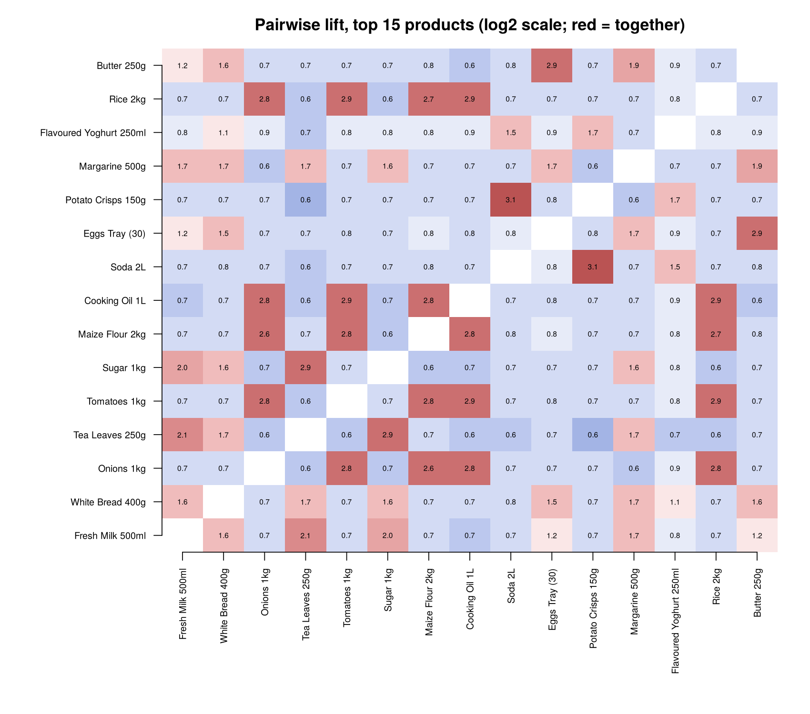

# Market Basket Analysis — what Kenyan shoppers buy together, in Python and R

Association-rule mining on **15,000 retail baskets** to answer five commercial questions: *what sells together, what to recommend next, what to bundle, where to place it, and how channels differ.* The analysis is built twice, once in **Python (mlxtend)** and once **from first principles in base R**, and the two implementations agree on every rule to 15 decimal places.

> **Data note:** the transactions are **synthetic**, generated by [`data/generate_transactions.py`](data/generate_transactions.py) to look like a Kenyan FMCG retail network (supermarkets and dukas, 44 products, 11 categories). No real company or customer data is used.

| | |
|---|---|
| 📓 **Full walkthrough with every step explained** | [`python/market_basket_analysis.ipynb`](python/market_basket_analysis.ipynb) |
| 📊 **R implementation and results report** | [`R/market_basket_analysis.R`](R/market_basket_analysis.R) → [`outputs/r/R_results.md`](outputs/r/R_results.md) |
| 📁 **Rule tables for business use** | [`outputs/python/association_rules.csv`](outputs/python/association_rules.csv), [`cross_sell_opportunity.csv`](outputs/python/cross_sell_opportunity.csv) |

---

## 1. Why do market basket analysis?

A single receipt tells you little. Thousands of receipts side by side show **how customers actually shop**: which products go on the same trip, which product pulls another into the basket, and which "missions" (tea time, dinner, a BBQ) drive store visits.

Retailers and manufacturers use that knowledge to:

- **grow basket value** through cross-selling and bundles
- **arrange shelves and stores** around shopping missions rather than supplier categories
- **design promotions that add sales** rather than discounting items people would have bought anyway
- **protect availability**: if A and B are always bought together, running out of B also loses the sale of A

### Business questions answered

| # | Question | Answered in |
|---|---|---|
| 1 | Which products are bought together far more than chance would predict? | Notebook §8 |
| 2 | Given a basket, what is the shopper likely to add next? | §13a (recommender) |
| 3 | Which pairs are worth bundling or co-promoting, and how much is it worth? | §13b (opportunity sizing) |
| 4 | What natural shopping missions exist? | §11 (product network) |
| 5 | Do supermarket and duka shoppers behave differently? | §12 (segments) |

---

## 2. The metrics, in plain English

For a rule **A → B** ("if A is in the basket, then B"):

| Metric | Formula | Meaning | How to use it |
|---|---|---|---|
| **Support** | P(A ∩ B) | Share of all baskets containing both | *Is the pattern common enough to matter?* |
| **Confidence** | P(B \| A) | Of baskets with A, the share that also have B | *How reliable is "A suggests B"?* It's directional: A→B ≠ B→A |
| **Lift** | conf / P(B) | How many times more likely B becomes when A is present | **>1** complements · **=1** independent · **<1** different missions/substitutes |
| **Leverage** | P(A∩B) − P(A)P(B) | Extra co-occurrence beyond what chance gives | >0 = positive association |
| **Conviction** | (1−P(B)) / (1−conf) | How much more often the rule would fail if A and B were independent | 1 = no rule; higher = stronger |

**Worked example**, *Spaghetti → Pasta Sauce*: support **4.0%** (595 baskets), confidence **53%**, lift **10.4**. A spaghetti shopper is about 10× more likely than average to buy sauce, yet **47% of spaghetti shoppers leave without it.** That gap is the cross-sell opportunity.

---

## 3. Method

```
transactions.csv ─► data-quality checks ─► basket × product binary matrix
      ─► FP-Growth frequent itemsets (min support 1% = 150 baskets; Apriori gives identical results)
      ─► association rules (confidence ≥ 30%, lift ≥ 1.2)
      ─► Fisher exact test + Bonferroni correction (remove chance patterns)
      ─► redundancy pruning (drop longer rules that add < 10% confidence)
      ─► visualise · segment by channel · recommender · revenue opportunity sizing
```

**Why these thresholds?** 1% support keeps niche but valuable pairs (bacon + eggs, cones + ice cream) while making sure every rule rests on at least 150 real baskets. A lift of 1.2 or more removes "milk goes with everything" rules that are frequent only because milk is in 37% of all baskets.

**Why two languages?** Python/mlxtend is the production-style implementation. The R script rebuilds every metric with matrix algebra (`crossprod(M)` gives all pair counts at once) as an **independent audit**. Result: **249 of 249 Python rules matched in R, maximum metric difference 3.6 × 10⁻¹⁵.**

---

## 4. Results

### 4.1 Strongest associations (by lift)

| Rule | Baskets | Confidence | Lift | What it means |
|---|---:|---:|---:|---|
| Baby Wipes → Diapers | 359 | 74% | 15.0 | Same need, same trip: the tightest pair in the data |
| Mozzarella + Spaghetti → Pasta Sauce | 206 | 70% | 13.6 | A complete "pasta night" meal solution |
| Cheddar + Spaghetti → Pasta Sauce | 178 | 64% | 12.5 | Cheese is part of the pasta mission, not just a dairy buy |
| Ice Cream Cones → Ice Cream | 279 | 71% | 12.4 | One-directional: the reverse rule is only 32% |
| Sausages + Eggs → Bacon | 227 | 57% | 11.5 | Weekend fry-up mission |
| Sausages + Soda → BBQ Sauce | 162 | 34% | 11.0 | BBQ / party mission |



### 4.2 Shopping missions found automatically

Community detection on the rule network recovers **8 missions** without being told any of them: tea-time & breakfast, BBQ/party & snacks, dinner cook, pasta night, cleaning, kids' lunch, dessert, and cereal/yoghurt/baby.



### 4.3 Supermarkets vs dukas

| | Supermarket | Duka |
|---|---:|---:|
| Baskets | 9,016 | 5,984 |
| Avg items per basket | 5.1 | 3.4 |
| Positive pair rules | 236 | 142 |
| Tea → Fresh Milk confidence | 75% | **83%** |
| Sugar → Fresh Milk confidence | 69% | **81%** |

Dukas are dominated by the **tea-time mission**, and its rules are *more* reliable there. About 100 rules exist only in supermarkets, which carry the richer meal and party missions.

### 4.4 Where the money is

Highest lift ≠ highest value. Ranking by **gap baskets** (A bought without B) × **price of B** × an illustrative **5% conversion**, the biggest opportunities are everyday dinner-cook and tea-time links, such as *Onions → Rice*, *Fresh Milk → Sugar* and *Onions → Cooking Oil*, plus *Yoghurt → Granola*.



### 4.5 Lift heatmap (R)

Red = bought together more than chance; blue = less. Breakfast items and dinner-cook items score about 0.6–0.7 against each other: shoppers tend to buy for one mission per trip.



---

## 5. Recommended actions

| Finding | Action |
|---|---|
| Tea + sugar + milk move as one unit, especially in dukas | Manage them as one **availability unit**: joint replenishment and short-supply alerts in field-force tools |
| Pasta + sauce + cheese form a meal solution | Recipe-led secondary display; cheese × pasta co-promotion |
| Cones depend on ice cream, not the reverse | Place cones *at* the freezer; trigger the prompt from ice cream to cones |
| BBQ and fry-up missions exist | Weekend "BBQ pack" bundles; deli cross-merchandising |
| Diapers ↔ wipes is the tightest pair | Adjacent shelving; low-risk bundle price |
| Channels differ | Dukas: range and availability discipline. Supermarkets: cross-category displays and app recommendations |

---

## 6. Where market basket analysis is used

| Industry | Application |
|---|---|
| **Retail & FMCG** | Planograms and shelf adjacency, promotion and bundle design, store layout, range rationalisation, spotting cannibalisation |
| **E-commerce** | "Frequently bought together", cart cross-sells, personalised email offers |
| **Distribution / route-to-market** | Suggested orders for small outlets, joint stocking rules, out-of-stock impact |
| **Banking & insurance** | Product-holding patterns for next-best-offer models |
| **Telecoms** | Bundle design (data + voice + mobile money) |
| **Healthcare** | Co-occurring diagnoses, co-prescription and drug-interaction screening |
| **Restaurants / QSR** | Combo meals and upsell prompts |
| **Manufacturing & maintenance** | Parts that fail together, for spares kitting |

---

## 7. Limitations and next steps

- **Association is not causation.** Validate actions with A/B or test-vs-control store trials.
- Rules ignore **quantity, margin and timing**. Extensions: utility-weighted mining, sequential patterns (next-visit purchases), seasonal splits.
- Rare high-value items can fall below the support threshold. Mine those categories separately, or use multiple minimum supports.
- On real data: join loyalty IDs for customer-level patterns, size opportunities with **margin** instead of price, and track rule stability month by month.

---

## 8. Run it

```bash
# Python
pip install -r requirements.txt
python data/generate_transactions.py                       # optional: regenerate data
python python/build_notebook.py                            # writes the notebook
jupyter nbconvert --to notebook --execute --inplace python/market_basket_analysis.ipynb

# R (base R only, no packages needed). Run after the notebook to enable the cross-check
Rscript R/market_basket_analysis.R
```

## Repository structure

```
market-basket-analysis/
├── data/
│   ├── generate_transactions.py      # synthetic basket generator (missions + impulse buys)
│   └── transactions.csv              # 15,000 baskets, 67k line items
├── python/
│   ├── build_notebook.py             # source of the notebook (readable diffs)
│   └── market_basket_analysis.ipynb  # executed walkthrough with all outputs
├── R/
│   └── market_basket_analysis.R      # base-R rebuild + cross-check + markdown report
└── outputs/
    ├── python/                       # charts, rules, segment & opportunity tables
    └── r/                            # R charts, rules and R_results.md
```

**Stack:** Python · pandas · mlxtend (FP-Growth, Apriori) · scipy · networkx · matplotlib · R (base, stats, graphics)
