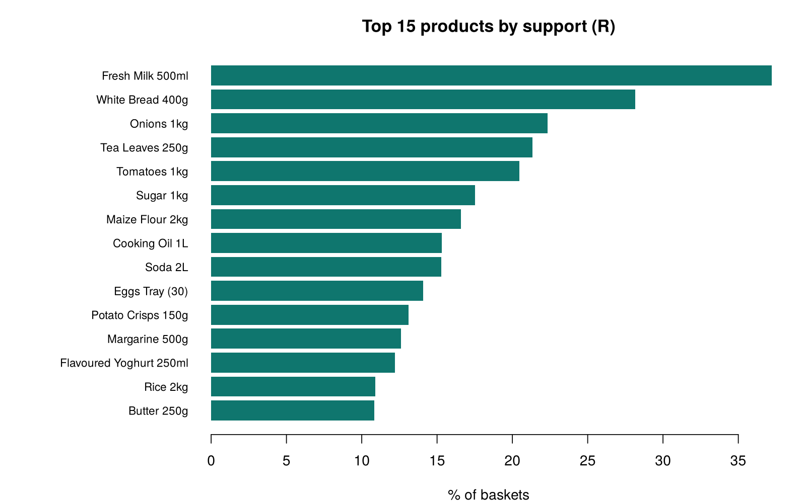
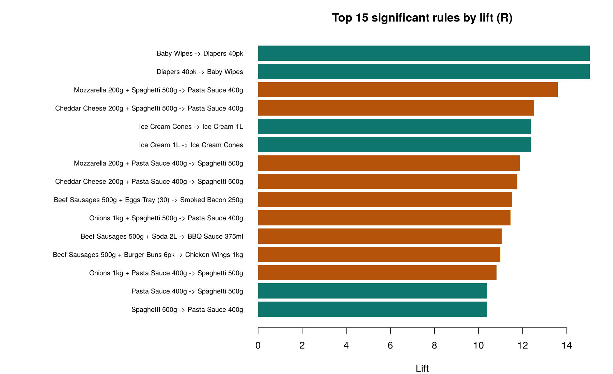

# Market Basket Analysis — R results (auto-generated by `R/market_basket_analysis.R`)

*15,000 baskets · 44 products · min support 1% · min confidence 30% · min lift 1.2*

## Rule counts

- Rules passing thresholds: **447** (102 pair rules, 345 triple rules)
- Significant after Fisher exact test + Bonferroni: **446**
- **Cross-check with Python:** Python rules checked: 249 | matched in R: 249 | max absolute metric difference: 3.55e-15

## Top 10 rules by lift

| rule | baskets | support | confidence | lift |
| --- | --- | --- | --- | --- |
| Baby Wipes → Diapers 40pk | 359 | 0.024 | 74% | 15.04 |
| Diapers 40pk → Baby Wipes | 359 | 0.024 | 49% | 15.04 |
| Mozzarella 200g + Spaghetti 500g → Pasta Sauce 400g | 206 | 0.014 | 70% | 13.60 |
| Cheddar Cheese 200g + Spaghetti 500g → Pasta Sauce 400g | 178 | 0.012 | 64% | 12.51 |
| Ice Cream Cones → Ice Cream 1L | 279 | 0.019 | 71% | 12.37 |
| Ice Cream 1L → Ice Cream Cones | 279 | 0.019 | 32% | 12.37 |
| Mozzarella 200g + Pasta Sauce 400g → Spaghetti 500g | 206 | 0.014 | 88% | 11.86 |
| Cheddar Cheese 200g + Pasta Sauce 400g → Spaghetti 500g | 178 | 0.012 | 87% | 11.76 |
| Beef Sausages 500g + Eggs Tray (30) → Smoked Bacon 250g | 227 | 0.015 | 57% | 11.52 |
| Onions 1kg + Spaghetti 500g → Pasta Sauce 400g | 191 | 0.013 | 59% | 11.44 |

## Highest-support rules (the everyday missions)

| rule | baskets | support | confidence | lift |
| --- | --- | --- | --- | --- |
| White Bread 400g → Fresh Milk 500ml | 2569 | 0.171 | 61% | 1.63 |
| Fresh Milk 500ml → White Bread 400g | 2569 | 0.171 | 46% | 1.63 |
| Tea Leaves 250g → Fresh Milk 500ml | 2536 | 0.169 | 79% | 2.13 |
| Fresh Milk 500ml → Tea Leaves 250g | 2536 | 0.169 | 45% | 2.13 |
| Sugar 1kg → Fresh Milk 500ml | 1967 | 0.131 | 75% | 2.01 |
| Fresh Milk 500ml → Sugar 1kg | 1967 | 0.131 | 35% | 2.01 |
| Tomatoes 1kg → Onions 1kg | 1923 | 0.128 | 63% | 2.80 |
| Onions 1kg → Tomatoes 1kg | 1923 | 0.128 | 57% | 2.80 |

## Channel comparison — highest-confidence rules in dukas

| rule | conf supermarket | conf duka | lift supermarket | lift duka |
| --- | --- | --- | --- | --- |
| Tea Leaves 250g → Fresh Milk 500ml | 75% | 83% | 2.10 | 2.11 |
| Sugar 1kg → Fresh Milk 500ml | 69% | 81% | 1.94 | 2.05 |
| Queen Cakes 6pk → Fresh Milk 500ml | 55% | 75% | 1.55 | 1.91 |
| Baby Wipes → Diapers 40pk | 74% | 73% | 11.14 | 31.89 |
| Margarine 500g → Fresh Milk 500ml | 59% | 71% | 1.65 | 1.80 |
| Sugar 1kg → Tea Leaves 250g | 55% | 70% | 3.10 | 2.60 |

## Charts

**Reading the heatmap:** each cell is the lift between two popular products. Values above 1 (red) mean the pair is bought together more often than chance would predict. Values below 1 (blue) mean they are bought together *less* often than chance, which usually signals different shopping missions. Here the breakfast/tea items (milk, bread, tea, sugar) score about 0.6-0.7 against the dinner-cook items (maize flour, oil, onions, tomatoes, rice): people tend to buy for one mission per trip.
